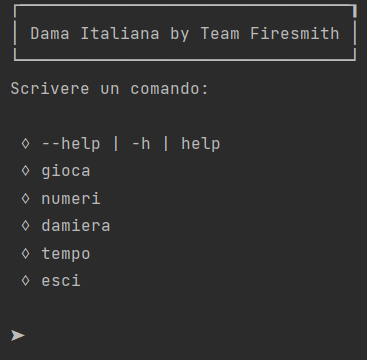

# Relazione tecnica finale

## Indice

1. [Introduzione](#Introduzione)
2. [Modello di dominio](#Modello-di-dominio)
3. [Requisiti specifici](#Requisiti-specifici)  
   a. [Requisiti funzionali](#Requisiti-funzionali)  
   b. [Requisiti non funzionali](#Requisiti-non-funzionali)

4. [System Design](#System-Design)
    - [Stile architetturale adottato](#Stile-architetturale-adottato)
    - [Diagramma dei package](#Diagramma-dei-package)
5. [O.O. Design](#OO-Design)
    - [Diagrammi delle classi e diagrammi di sequenza   (per le user story considerate più importanti)](#Diagrammi-delle-classi-e-diagrammi-di-sequenza)  
    - [Design pattern utilizzati](#Design-pattern)
    - [Commenti](#Commenti)
6. [Riepilogo dei test](#Riepilogo-dei-test)
    - [Tabella riassuntiva di coveralls](#Tabella-riassuntiva)
7. [Manuale utente](#Manuale-utente)
8. [Processo di sviluppo e organizzazione del lavoro](#Processo-di-sviluppo-e-organizzazione-del-lavoro)
9. [Analisi retrospettiva](#Analisi-retrospettiva)
    - [Soddisfazioni](#Soddisfazioni)
    - [Insoddisfazioni](#Insoddisfazioni)
    - [Cosa ci ha fatti impazzire](#Cosa-ci-ha-fatti-impazzire)

# Introduzione
*Dama by Firesmith &#169;*  è un' applicazione che simula il gioco della dama italiana, con un' interfaccia a linea di comando.
Il programma accetta le mosse inserite dall'utente secondo la notazione algebrica standard (per esempio, 1x5 e 1-5), permettendo a due giocatori
di sfidarsi localmente.  

Il progetto è stato realizzato durante il corso di Ingegneria del Software (a.a. 2020/2021) dal gruppo Firesmith,
i cui membri sono:
- [Giacomo Signorile](https://github.com/GiacomoSignorile)
- [Tommaso Perniola](https://github.com/t-perniola)
- [Ester Molinari](https://github.com/e-molinari)
- [Christian Riefolo](https://github.com/LITHUBuniba)
- [Antonio Papeo](https://github.com/AntonioPapeo6) 
- [Ruggiero Zagaria](https://github.com/RuggieroZagaria)   

[Torna all'indice](#Indice)

# Modello di dominio

  

[Torna all'indice](#Indice)

# Requisiti Specifici

Di seguito sono riportati i requisiti funzionali (in ordine cronologico rispetto alla creazione degli issue corrispondenti) seguiti dai requisiti non funzionali.

## Requisiti funzionali

- [Iniziare una partita](https://github.com/softeng2021-inf-uniba/progetto2021ter-firesmith/issues/21)

  *Come giocatore voglio iniziare una nuova partita*

  **Criteri di accettazione**

  Al comando `gioca`
  * se nessuna partita è in corso l'app si predispone a ricevere la prima mossa di gioco o altri comandi
  

- [Chiudere il gioco](https://github.com/softeng2021-inf-uniba/progetto2021ter-firesmith/issues/39)

  _Come giocatore voglio chiudere il gioco_
  
  **Criteri di accettazione:** 
   Al comando `esci`
  * l'applicazione chiede conferma
  * se la conferma è positiva, l'app si chiude restituendo un _zero exit code_
  * se la conferma è negativa, l'app si predispone a ricevere nuovi comandi

- [Comando help](https://github.com/softeng2021-inf-uniba/progetto2021ter-firesmith/issues/18)

  L'utente può visualizzare l'elenco dei comandi disponibili tramite il comando `help` o invocando l'app con flag `--help`  o `-h`
  .

  <b>Criteri di accettazione:</b>

  Eseguendo il comando <code>help</code>, il risultato è una lista di comandi che puoi eseguire, uno per riga,
  ovvero:  
  
  

- [Mostrare la damiera con numerazione](https://github.com/softeng2021-inf-uniba/progetto2021ter-firesmith/issues/19)
   
  _Come giocatore voglio mostrare la damiera con la numerazione in modo da ricordare come sono numerate le caselle della damiera_

  **Criteri di accettazione**
  
  Al comando `numeri`
  * l'app mostra la damiera con i numeri sulle caselle nere 
    
  

- [Mostrare damiera con pezzi](https://github.com/softeng2021-inf-uniba/progetto2021ter-firesmith/issues/20)
  
  _Come giocatore voglio mostrare la damiera con i pezzi in modo da visualizzare lo stato del gioco_
  
  

  **Criteri di accettazione**
   
  Al comando `damiera`
  * se il gioco è iniziato l'app mostra la posizione di tutti pezzi sulla damiera
  * i pezzi sono mostrati in formato [Unicode](https://en.wikipedia.org/wiki/English_draughts#Unicode)
  * se il gioco non è iniziato l'app suggerisce il comando `gioca`
  
  L'utente può visualizzare a schermo la scacchiera tramite il comando <code>gioca</code>
  
 
  Tutti i pezzi sono rappresentati nel contesto della damiera in UTF-8 con i caratteri specifici (es.  ⛂ per il bianco e ⛀ per il nero).
     

- [Mostrare le mosse giocate](https://github.com/softeng2021-inf-uniba/progetto2021ter-firesmith/issues/34)

  _Come giocatore voglio visualizzare le mosse giocate in modo da poter ripercorrere mentalmente la storia della partita giocata_

  **Criteri di accettazione**
  
  Al comando `mosse` l'app mostra la storia delle mosse con notazione algebrica
  _Esempio:_
  <code> Bianco: 21-18 </code> 
  <code> Nero: 10-14 </code> 
  <code> Bianco: 24-20 </code> 
  <code> Nero: 14x21 </code> 
  <code> Bianco: 14x21x32 </code>  
   ...
  
   

- [Spostare una pedina (spostamento semplice)](https://github.com/softeng2021-inf-uniba/progetto2021ter-firesmith/issues/25)  

  _Come giocatore voglio spostare una pedina mediante spostamento semplice_

  **Criteri di accettazione**
  * a partita in corso di gioco, l'app deve accettare mosse di spostamento semplice di pedina in notazione algebrica.
  Es. 1-5
  * Lo spostamento semplice della pedina deve rispettare le regole del gioco della dama italiana, escludendo damature e prese:
  http://www.fid.it/regolamenti/capo1.htm
  In particolare (Art. 4 - Gli spostamenti semplici)

  > La pedina può essere mossa solo in avanti e in diagonale e portata dalla casella di partenza in una casella libera contigua.

- [Spostare una pedina con presa semplice](https://github.com/softeng2021-inf-uniba/progetto2021ter-firesmith/issues/26)

  _Come giocatore voglio spostare una pedina con presa semplice_

  **Criteri di accettazione**
  * a partita in corso di gioco, l'app deve accettare mosse di spostamento di pedina con presa semplice in notazione algebrica.
  _Es. 18x11 (se è il bianco a muovere)_
  * Lo spostamento della pedina con presa semplice deve rispettare le regole del gioco della dama italiana
  (http://www.fid.it/regolamenti/capo1.htm)
  (In particolare Art. 5 e 6)

- [Spostare una pedina con presa multipla](https://github.com/softeng2021-inf-uniba/progetto2021ter-firesmith/issues/27)

  _Come giocatore voglio spostare una pedina con presa multipla_

  **Criteri di accettazione**
  * a partita in corso di gioco, l'app deve accettare mosse di spostamento di pedina con presa multipla in notazione algebrica.
  _Es. 22x15x6 (se è il bianco a muovere)_
  * Lo spostamento della pedina con presa multipla deve rispettare le regole del gioco della dama italiana
  (http://www.fid.it/regolamenti/capo1.htm)
  In particolare (Art. 5 e 6)

- [Spostare una pedina con damatura](https://github.com/softeng2021-inf-uniba/progetto2021ter-firesmith/issues/282)

  _Come giocatore voglio spostare una pedina con damatura_

  **Criteri di accettazione**
  * a partita in corso di gioco, l'app deve accettare mosse di spostamento semplice di pedina in notazione algebrica che terminano con la damatura.
  _Es. 6-3 oppure se c'è una presa 10x3_
  * Lo spostamento con damatura deve rispettare le regole del gioco della dama italiana:
  http://www.fid.it/regolamenti/capo1.htm
    

- [Mostrare il tempo di gioco](https://github.com/softeng2021-inf-uniba/progetto2021ter-firesmith/issues/40)

  _Come giocatore voglio mostrare il tempo di gioco_

  **Criteri di accettazione:**
   
  Al comando `tempo`
  * se il gioco è in corso
  * l'app mostra il tempo trascorso per il Bianco dall'inizio del gioco
  * l'app mostra il tempo trascorso per il Nero dall'inizio del gioco
  * se il gioco non è in corso l'app suggerisce il comando `gioca` e si predispone a ricevere nuovi comandi

- [Mostrare le prese](https://github.com/softeng2021-inf-uniba/progetto2021ter-firesmith/issues/32)

  _Come giocatore voglio visualizzare le prese in modo da valutare se è il caso di offrire una patta o abbandonare_

  **Criteri di accettazione**

  Al comando `prese` l'app mostra le prese del Bianco e del Nero con caratteri Unicode 
  _Es._ 
  Bianco: ⛀ ⛀ ⛀ ⛀ 
  Nero: ⛂ ⛂ 
  

- [Abbandonare la partita](https://github.com/softeng2021-inf-uniba/progetto2021ter-firesmith/issues/35)

  _Come giocatore voglio abbandonare la partita_

  **Criteri di accettazione:** 
  Al comando `abbandona` 
  * l'app chiede conferma
  * se la conferma è positiva, l'app comunica che il Bianco (o Nero) ha vinto per abbandono
  * se la conferma è negativa, l'app si predispone a ricevere nuovi comandi

[Torna all'indice](#Indice)

## Requisiti non funzionali

- ### Portabilità
  L'applicazione è disponibile per le seguenti piattaforme:
    - terminale di Linux;
    - teminale di MacOS;
    - Windows Terminal;
    - Git Bash (in questo caso il comando Docker ha come prefisso winpty; es:  
      <code>winpty docker -it ...</code>)

- ### Affidabilità
  L'applicazione è strutturata in modo tale da evitare eccezioni e malfunzionamenti dovuti a inserimenti errati:
  è presente un messaggio di errore per ogni comando non ammesso dall'applicazione e la gestione di un'eccezione 
  riguardante l'inserimento di input con caratteri speciali non ammessi.

- ### Manutenibilità

  L'applicazione è suddivisa semanticamente in diversi package;
  in particolare il package 'Strumenti' adotta/implementa:
  
  - una classe 'Costanti' che racchiude tutte le costanti utilizzate nel codice;
    alcune di esse potrebbero essere sostituite dai più eleganti Enumerativi.
  - un sistema di gestione dell'input, che tramite l'utilizzo di una espressione regolare 
    è in grado di capire il tipo di mossa inserita.

 

[Torna all'indice](#Indice)

# System Design

## Stile architetturale adottato

&#200; stato adottato lo stile architetturale *Model-View-Controller*, nella sua variante *Entity-Control-Boundary* incentrato sui casi d'uso: essi sfruttano
la prospettiva dell'utente, mettendo in evidenza le funzionalità del sistema, 
così come le percepisce chi interagisce dal mondo esterno.
 

Per questi motivi abbiamo strutturato il nostro progetto seguendo i tre stereotipi di classe individuati dallo stile ECB:

- <b>Entity</b>
  
  Modello che rappresenta degli oggetti presenti all'interno del dominio, 

  Ad esempio :
   - <code>Damiera</code>, è una classe entity che contiene i metodi per costruire e gestire la damiera. 
   - <code>Partita</code>, contiene i metodi per creare una nuova Partita e gestirla.
   - <code>Pedina</code>, contiene le caratteristiche di ogni casella della damiera.
   - <code>Giocatore</code>, contiene i metodi per gestire il giocatore.
  
- <b>Control</b>
  
  Modello di oggetti che determinano il modo in cui l'applicazione risponde agli input degli attori, interpreta le 
  richieste dell'utente e il loro passaggio alla logica applicativa.
  
  Ad Esempio:
   - <code> Menu</code>, è una classe che contiene i metodi per collegare l'utente al gioco e gestirlo.
   - <code> Turno</code>, è una classe che contiene i metodi per gestire i turni e interfaccia l'utente con il giocatore bianco o con il nero.  
   - <code> Mossa</code>, contiene i metodi per gestire le mosse , che verranno inserite dall'utente. 
  - <code> Comando</code>, contiene i metodi per gestire delle funzioni del menu come abbandona o esci.

- <b>Boundary</b>
   
  Modello di oggetti che funge da interfaccia tra utente e sistema.

  Ad esempio:
  - <code>Messaggi</code>, classe che racchiude tutti i messaggi rivolti all'utente, allo scopo
  di agevolare l'interazione con il sistema

## Diagramma dei package

 

[Torna all'indice](#Indice)

# O.O. Design

## Diagrammi delle classi e diagrammi di sequenza

### Diagramma delle classi con prospettiva software completo

### Diagramma delle classi con prospettiva software per la user story "Mostrare Damiera con pezzi"

### Diagramma delle classi con prospettiva software per la user story "Spostamento con presa semplice"

### Diagramma di sequenza per la user story "Spostamento con presa semplice"

### Diagramma di sequenza per la user story "Spostamento con presa multipla"

### Diagramma di sequenza per la user story "Abbandonda la partita"

 

[Torna all'indice](#Indice)

## Design pattern

Nel progetto è stato applicato il Pattern di creazione
[Singleton](https://it.wikipedia.org/wiki/Singleton_(informatica))
appartenente al paradigma orientato
agli oggetti:

Il pattern di creazione **Singleton** è stato applicato nella classe `Menu`. Questa scelta è stata
fatta poiché a livello implementativo è necessaria la presenza di una sola istanza di essa che
interagirà con l'utente.

 

[Torna all'indice](#Indice)

# Riepilogo dei test
## Tabelle riassuntiva

Qui di seguito riportiamo:
- La tabella riassuntiva del coverage generata da _JaCoCo_;

  
 
- Il report di Gradle sui test eseguiti;

  

- Infine, il report di [Coveralls](https://coveralls.io/github/softeng2021-inf-uniba/progetto2021ter-firesmith).
  
   
  

  

[Torna all'indice](#Indice)

# Manuale utente
Per utilizzare il programma occorre eseguire Docker da terminale (o da applicazione desktop) ed inserire il seguente comando:
<code>docker pull docker.pkg.github.com/softeng2021-inf-uniba/progetto2021ter-firesmith/dama-firesmith:latest</code>

Successivamente, va inserito il comando:
<code>docker run -it --rm docker.pkg.github.com/softeng2021-inf-uniba/progetto2021ter-firesmith/dama-firesmith:latest</code>

Il programma all'avvio mostra il menu iniziale:

> I comandi vanno inseriti quando è presente il simbolo <code>➤</code>

Nel menu appena comparso si possono inserire i seguenti comandi:
- <code>--help</code><code>-h</code><code>help</code>: elenca tutti i comandi riconosciuti dal programma
- <code>gioca</code>: permette di iniziare una nuova partita; come da regolamento, inizia per primo il giocatore bianco
- <code>numeri</code>: mostra una damiera con il numero di ogni posizione delle pedine, da 1 a 32; le caselle nere non presentano alcun numero
- <code>damiera</code>: questo comando genera un messaggio di errore in quanto per essere utilizzato deve essere in corso la partita
- <code>tempo</code>: questo comando genera un messaggio di errore in quanto per essere utilizzato deve essere in corso una partita
- <code>esci</code>: chiude il programma

Dopo aver inserito il comando <code>gioca</code>, si presenta il menu del giocatore con ulteriori comandi:
- <code>abbandona</code>: permette al giocatore di abbandonare la partita; mostra un messaggio diverso in base a chi abbandona la partita
- <code>'spostamento'</code>: quando viene inserito un comando di tipo Spostamento semplice (vedi tabella sotto), la controlla e viene eseguita se corretta
- <code>'presa semplice'</code>: quando viene inserito un comando di tipo Presa semplice (vedi tabella sotto), la controlla e viene eseguita se corretta
- <code>'presa multipla'</code>: quando viene inserito un comando di tipo Presa multipla (vedi tabella sott), la controlla e viene eseguita se corretta
- <code>prese</code>: mostra le pedine mangiate rispettivamente da entrambi i giocatori durante la partita
- <code>mosse</code>: mostra tutti i comandi inseriti da entrambi i giocatori durante la partita

> Quando viene inserito un comando non valido o sbagliato, il programma mostra un messaggio di errore.

All'inizio della partita il programma attende la prima mossa del giocatore bianco.
Al giocatore viene anche data la possibilità di abbandonare la partita appena iniziata.
Il programma riconosce le seguenti mosse:

| Mossa | Notazione |
|-----|-----|
| Spostamento semplice | N-N |
| Presa semplice | NxN |
| Presa multipla | NxNxN |
| Presa multipla | NxNxNxN |

Dove **N** è un numero intero compreso tra 1 e 32 (corrisponde alla casella in cui si vuole spostare la pedina).

Nel caso in cui la mossa non risulta valida, il programma permette il reinserimento della mossa o degli altri comandi.

[Torna all'indice](#Indice)

# Processo di sviluppo e organizzazione del lavoro

- ## Processo di sviluppo
  Lo stile di processo di sviluppo adottato è stato quello iterativo,
  secondo il modello [Scrum](https://it.wikipedia.org/wiki/Scrum_%28informatica%29), che prevede una serie di iterazioni
  chiamate Sprint (quattro nel nostro caso), ciascuno dei quali con uno obiettivo principale, lo <b>Sprint Goal</b>.

- ## Piattaforma di comunicazione adottata
  La piattaforma utilizzata è stata [Discord](https://discord.com/), in quanto consente una rapida e comoda
  comunicazione fra più persone, supportando strumenti molto utili come la condivisione schermo.
  
- ## WorkFlow utilizzato

   &#200; stato adottato il workflow <b>GitHub Actions</b>
   
   

- ## Suddivisione dei compiti
  Fin dalla creazione del gruppo la divisione dei compiti da svolgere è stata effettuata con l'obiettivo di essere quanto più *equi* ed <b>onesti</b> possibile.  
  In particolare durante gli <i>scrum meetings</i> giornalieri, tenuti durante i primi dieci-quindici minuti, abbiamo ripartito i task delle issue tra i membri, in modo da allocare i compiti in base alle seguenti caratteristiche di ogni membro:
  - lavoro svolto durante le giornate precedenti;
  - lavoro ancora da svolgere per soddisfare il <i>definition of done</i>;
  - propensione di uno o più componenti del gruppo nei confronti della risoluzione di un determinato task.

   La suddivisione dei compiti e degli issue può essere osservata [qui](https://github.com/softeng2021-inf-uniba/progetto2021ter-firesmith/projects/3).
  Giornalmente venivano anche stabilite le priorità dei task da portare a termine.  
  Il lavoro è stato suddiviso in modo sequenziale in modo da svolgere le issue più importanti o quelle necessarie
  a svolgere la issue successiva , tutto ciò in base
  a ciò che era stato assegnato per ogni <i>milestone</i>.   

- ## Pair programming e revisione
  Il pair programming è stato adottato in modo da assegnare i task più o meno difficoltosi a uno o più membri del team, in modo da 
  semplificare il lavoro. Mentre un membro del team svolgeva l'issue il suo compagno controllava o forniva nuove idee su come risolvere al meglio 
  l'issue, nel caso un membro si trovasse in difficoltà, richiedeva uno scrum meeting con gli altri membri del team, dove il collega condivideva il suo schermo o
  la propria sessione di lavoro e veniva aiutato nello svolgimento. A tale proposito è stato estremamente utile lo strumento
  fornito dall'IDE IntellijIDEA, [CodeWithMe](https://www.jetbrains.com/code-with-me/).  
   Per quanto riguarda gli issue che, secondo una mera previsione, avrebbero richiesto meno tempo, essi venivano assegnati ad un solo membro del team.
  
   Per quanto concerne le varie *review* del codice, dopo ogni pull request, venivano assegnati uno o più membri "non partecipanti" all'issue, che ne controllavano
  il corretto funzionamento del programma e
  la corretta scrittura del codice, i cosiddetti *rewiers*.
  

- ## Uso delle boards
  Abbiamo utilizzato delle board integrate in <b> GitHub </b> in modo da segnare lo stato degli issue.
  Tale board è stata composta da delle cards, formati da issue, posti su un totale di 5 colonne:
  - <b>TO DO</b> dove inserivamo le <i>issues</i> appena create, da svolgere;
  - <b>IN PROGRESS</b> dove si trovavano le <i>issues</i> che erano state aperte e in stato di stato di lavorazione;
  - <b>REVIEW</b> dove venivano collocate le <i>issues</i> da revisionare dai componenti del
    team;
  - <b>READY</b> dove si posizionavano le <i>issues</i> da revisionare dai docenti;
  - <b>DONE</b> dove si aggiungevano le <i>issues</i> portate a termine e ufficialmente chiuse;

   &#200; stata creata una
  [project board generale](https://github.com/softeng2021-inf-uniba/progetto2021ter-firesmith/projects/3)
  (per le user stories) e le seguenti sprint boards:
  - [Sprint 0](https://github.com/softeng2021-inf-uniba/progetto2021ter-firesmith/projects/1)
  - [Sprint 1](https://github.com/softeng2021-inf-uniba/progetto2021ter-firesmith/projects/2)
  - [Sprint 2](https://github.com/softeng2021-inf-uniba/progetto2021ter-firesmith/projects/4)
  - [Sprint 3](https://github.com/softeng2021-inf-uniba/progetto2021ter-firesmith/projects/5)

  

[Torna all'indice](#Indice)

# Analisi retrospettiva
## Soddisfazioni

## Insoddisfazioni

## Cosa ci ha fatti impazzire

  

[Torna all'indice](#Indice)
