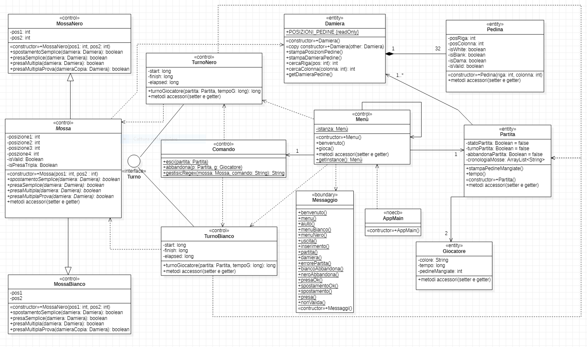

# Relazione tecnica finale

## Indice

1. [Introduzione](#Introduzione)
2. [Modello di dominio](#Modello-di-dominio)
3. [Requisiti specifici](#Requisiti-specifici)  
   a. [Requisiti funzionali](#Requisiti-funzionali)  
   b. [Requisiti non funzionali](#Requisiti-non-funzionali)

4. [System Design](#System-Design)
    - [Stile architetturale adottato](#Stile-architetturale-adottato)
    - [Diagramma dei package](#Diagramma-dei-package)
5. [O.O. Design](#OO-Design)
    - [Diagrammi delle classi e diagrammi di sequenza   (per le user story considerate più importanti)](#Diagrammi-delle-classi-e-diagrammi-di-sequenza)  
    - [Design pattern utilizzati](#Design-pattern)
    - [Commenti](#Commenti)
6. [Riepilogo dei test](#Riepilogo-dei-test)
    - [Tabella riassuntiva di coveralls](#Tabella-riassuntiva)
7. [Manuale utente](#Manuale-utente)
8. [Processo di sviluppo e organizzazione del lavoro](#Processo-di-sviluppo-e-organizzazione-del-lavoro)
9. [Analisi retrospettiva](#Analisi-retrospettiva)
    - [Soddisfazioni](#Soddisfazioni)
    - [Insoddisfazioni](#Insoddisfazioni)
    - [Cosa ci ha fatti impazzire](#Cosa-ci-ha-fatti-impazzire)

# Introduzione
Dama-Firesmith è un' applicazione per il gioco della dama con interfaccia a linea di comando.
Il gioco accetta comandi in [notazione algebrica italiana abbreviata](https://it.wikipedia.org/wiki/Notazione_algebrica) e permette a due giocatori
di sfidarsi localmente.  
L'esecuzione avviene a linea di comando via [Docker](https://hub.docker.com/).
Il progetto è stato realizzato durante il corso di Ingegneria del Software dal gruppo Firesmith
(a.a. 2020/2021), i cui membri sono:
- [Giacomo Signorile](https://github.com/GiacomoSignorile)
- [Tommaso Perniola](https://github.com/t-perniola)
- [Ester Molinari](https://github.com/e-molinari)
- [Christian Riefolo](https://github.com/LITHUBuniba)
- [Antonio Papeo](https://github.com/AntonioPapeo6) 
- [Ruggiero Zagaria](https://github.com/RuggieroZagaria)   

[Torna all'indice](#Indice)

# Modello di dominio

  

[Torna all'indice](#Indice)

# Requisiti Specifici

Di seguito sono riportati i requisiti funzionali (in ordine cronologico rispetto alla creazione degli issue corrispondenti) seguiti dai requisiti non funzionali.

## Requisiti funzionali

- [Iniziare una partita](https://github.com/softeng2021-inf-uniba/progetto2021ter-firesmith/issues/21)

  *Come giocatore voglio iniziare una nuova partita*

  **Criteri di accettazione**

  Al comando `gioca`
  * se nessuna partita è in corso l'app si predispone a ricevere la prima mossa di gioco o altri comandi
  

- [Chiudere il gioco](https://github.com/softeng2021-inf-uniba/progetto2021ter-firesmith/issues/39)

  _Come giocatore voglio chiudere il gioco_
  
  **Criteri di accettazione:** 
   Al comando `esci`
  * l'applicazione chiede conferma
  * se la conferma è positiva, l'app si chiude restituendo un _zero exit code_
  * se la conferma è negativa, l'app si predispone a ricevere nuovi comandi

- [Comando help](https://github.com/softeng2021-inf-uniba/progetto2021ter-firesmith/issues/18)

  L'utente può visualizzare l'elenco dei comandi disponibili tramite il comando `help` o invocando l'app con flag `--help`  o `-h`
  .

  <b>Criteri di accettazione:</b>

  Eseguendo il comando <code>help</code>, il risultato è una lista di comandi che puoi eseguire, uno per riga,
  ovvero:  
  
  

- [Mostrare la damiera con numerazione](https://github.com/softeng2021-inf-uniba/progetto2021ter-firesmith/issues/19)
   
  _Come giocatore voglio mostrare la damiera con la numerazione in modo da ricordare come sono numerate le caselle della damiera_

  **Criteri di accettazione**
  
  Al comando `numeri`
  * l'app mostra la damiera con i numeri sulle caselle nere 
    
  

- [Mostrare damiera con pezzi](https://github.com/softeng2021-inf-uniba/progetto2021ter-firesmith/issues/20)
  
  _Come giocatore voglio mostrare la damiera con i pezzi in modo da visualizzare lo stato del gioco_
  
  

  **Criteri di accettazione**
   
  Al comando `damiera`
  * se il gioco è iniziato l'app mostra la posizione di tutti pezzi sulla damiera
  * i pezzi sono mostrati in formato [Unicode](https://en.wikipedia.org/wiki/English_draughts#Unicode)
  * se il gioco non è iniziato l'app suggerisce il comando `gioca`
  
  L'utente può visualizzare a schermo la scacchiera tramite il comando <code>gioca</code>
  
 
  Tutti i pezzi sono rappresentati nel contesto della damiera in UTF-8 con i caratteri specifici (es.  ⛂ per il bianco e ⛀ per il nero).
     

- [Mostrare le mosse giocate](https://github.com/softeng2021-inf-uniba/progetto2021ter-firesmith/issues/34)

  _Come giocatore voglio visualizzare le mosse giocate in modo da poter ripercorrere mentalmente la storia della partita giocata_

  **Criteri di accettazione**
  
  Al comando `mosse` l'app mostra la storia delle mosse con notazione algebrica
  _Esempio:_
  <code> Bianco: 21-18 </code> 
  <code> Nero: 10-14 </code> 
  <code> Bianco: 24-20 </code> 
  <code> Nero: 14x21 </code> 
  <code> Bianco: 14x21x32 </code>  
   ...
  
   

- [Spostare una pedina (spostamento semplice)](https://github.com/softeng2021-inf-uniba/progetto2021ter-firesmith/issues/25)  

  _Come giocatore voglio spostare una pedina mediante spostamento semplice_

  **Criteri di accettazione**
  * a partita in corso di gioco, l'app deve accettare mosse di spostamento semplice di pedina in notazione algebrica.
  Es. 1-5
  * Lo spostamento semplice della pedina deve rispettare le regole del gioco della dama italiana, escludendo damature e prese:
  http://www.fid.it/regolamenti/capo1.htm
  In particolare (Art. 4 - Gli spostamenti semplici)

  > La pedina può essere mossa solo in avanti e in diagonale e portata dalla casella di partenza in una casella libera contigua.

- [Spostare una pedina con presa semplice](https://github.com/softeng2021-inf-uniba/progetto2021ter-firesmith/issues/26)

  _Come giocatore voglio spostare una pedina con presa semplice_

  **Criteri di accettazione**
  * a partita in corso di gioco, l'app deve accettare mosse di spostamento di pedina con presa semplice in notazione algebrica.
  _Es. 18x11 (se è il bianco a muovere)_
  * Lo spostamento della pedina con presa semplice deve rispettare le regole del gioco della dama italiana
  (http://www.fid.it/regolamenti/capo1.htm)
  (In particolare Art. 5 e 6)

- [Spostare una pedina con presa multipla](https://github.com/softeng2021-inf-uniba/progetto2021ter-firesmith/issues/27)

  _Come giocatore voglio spostare una pedina con presa multipla_

  **Criteri di accettazione**
  * a partita in corso di gioco, l'app deve accettare mosse di spostamento di pedina con presa multipla in notazione algebrica.
  _Es. 22x15x6 (se è il bianco a muovere)_
  * Lo spostamento della pedina con presa multipla deve rispettare le regole del gioco della dama italiana
  (http://www.fid.it/regolamenti/capo1.htm)
  In particolare (Art. 5 e 6)

- [Spostare una pedina con damatura](https://github.com/softeng2021-inf-uniba/progetto2021ter-firesmith/issues/282)

  _Come giocatore voglio spostare una pedina con damatura_

  **Criteri di accettazione**
  * a partita in corso di gioco, l'app deve accettare mosse di spostamento semplice di pedina in notazione algebrica che terminano con la damatura.
  _Es. 6-3 oppure se c'è una presa 10x3_
  * Lo spostamento con damatura deve rispettare le regole del gioco della dama italiana:
  http://www.fid.it/regolamenti/capo1.htm
    

- [Mostrare il tempo di gioco](https://github.com/softeng2021-inf-uniba/progetto2021ter-firesmith/issues/40)

  _Come giocatore voglio mostrare il tempo di gioco_

  **Criteri di accettazione:**
   
  Al comando `tempo`
  * se il gioco è in corso
  * l'app mostra il tempo trascorso per il Bianco dall'inizio del gioco
  * l'app mostra il tempo trascorso per il Nero dall'inizio del gioco
  * se il gioco non è in corso l'app suggerisce il comando `gioca` e si predispone a ricevere nuovi comandi

- [Mostrare le prese](https://github.com/softeng2021-inf-uniba/progetto2021ter-firesmith/issues/32)

  _Come giocatore voglio visualizzare le prese in modo da valutare se è il caso di offrire una patta o abbandonare_

  **Criteri di accettazione**

  Al comando `prese` l'app mostra le prese del Bianco e del Nero con caratteri Unicode 
  _Es._ 
  Bianco: ⛀ ⛀ ⛀ ⛀ 
  Nero: ⛂ ⛂ 
  

- [Abbandonare la partita](https://github.com/softeng2021-inf-uniba/progetto2021ter-firesmith/issues/35)

  _Come giocatore voglio abbandonare la partita_

  **Criteri di accettazione:** 
  Al comando `abbandona` 
  * l'app chiede conferma
  * se la conferma è positiva, l'app comunica che il Bianco (o Nero) ha vinto per abbandono
  * se la conferma è negativa, l'app si predispone a ricevere nuovi comandi

[Torna all'indice](#Indice)

## Requisiti non funzionali

- ### Portabilità
  L'applicazione è disponibile per le seguenti piattaforme:
    - terminale di Linux;
    - teminale di MacOS;
    - Windows Terminal;
    - Git Bash (in questo caso il comando Docker ha come prefisso winpty; es:  
      <code>winpty docker -it ...</code>)

- ### Affidabilità
  L'applicazione è strutturata in modo tale da evitare eccezioni e malfunzionamenti dovuti a inserimenti errati:
  è presente un messaggio di errore per ogni comando non ammesso dall'applicazione e la gestione di un'eccezione 
  riguardante l'inserimento di input con caratteri speciali non ammessi.

- ### Manutenibilità

  L'applicazione è suddivisa semanticamente in diversi package;
  in particolare il package 'Strumenti' adotta/implementa:
  
  - una classe 'Costanti' che racchiude tutte le costanti utilizzate nel codice;
    alcune di esse potrebbero essere sostituite dai più eleganti Enumerativi.
  - un sistema di gestione dell'input, che tramite l'utilizzo di una espressione regolare 
    è in grado di capire il tipo di mossa inserita.

  

[Torna all'indice](#Indice)

# System Design

## Stile architetturale adottato

E' stato adottato lo stile architetturale Entity-Control-Boundary incentrato sui casi d'uso: essi sfruttano
la prospettiva dell'utente, mettendo in evidenza le funzionalità del sistema, 
così come le percepisce chi interagisce dal mondo esterno.
 

Per questi motivi abbiamo strutturato il nostro progetto seguendo i tre stereotipi di classe individuati dallo stile ECB:

- <b>Entity</b>
  
  Modello che rappresenta degli oggetti presenti all'interno del dominio, 

  Ad esempio :
   - <code>Damiera</code>, è una classe entity che contiene i metodi per costruire e gestire la damiera. 
   - <code>Partita</code>, contiene i metodi per creare una nuova Partita e gestirla.
   - <code>Pedina</code>, contiene le caratteristiche di ogni casella della damiera.
   - <code>Giocatore</code>, contiene i metodi per gestire il giocatore.
  
- <b>Control</b>
  
  Modello di oggetti che determinano il modo in cui l'applicazione risponde agli input degli attori, interpreta le 
  richieste dell'utente e il loro passaggio alla logica applicativa.
  
  Ad Esempio:
   - <code> Menu</code>, è una classe che contiene i metodi per collegare l'utente al gioco e gestirlo.
   - <code> Turno</code>, è una classe che contiene i metodi per gestire i turni e interfaccia l'utente con il giocatore bianco o con il nero.  
   - <code> Mossa</code>, contiene i metodi per gestire le mosse , che verranno inserite dall'utente. 
  - <code> Comando</code>, contiene i metodi per gestire delle funzioni del menu come abbandona o esci.

- <b>Boundary</b>
   
  Modello di oggetti che funge da interfaccia tra utente e sistema.

  Ad esempio:
  - <code>Messaggi</code>, classe che racchiude tutti i messaggi rivolti all'utente, allo scopo
  di agevolare l'interazione con il sistema

## Diagramma dei package

  

[Torna all'indice](#Indice)

# O.O. Design

## Diagrammi delle classi e diagrammi di sequenza

### Diagramma delle classi con prospettiva software completo

### Diagramma delle classi con prospettiva software per la user story "Mostrare Damiera con pezzi"

### Diagramma delle classi con prospettiva software per la user story "Spostamento con presa semplice "

### Diagramma di sequenza per la user story "Spostamento con presa semplice "

### Diagramma di sequenza per la user story "Spostamento con presa multipla "

### Diagramma di sequenza per la user story "Abbandonda la partita"

  

[Torna all'indice](#Indice)

## Design pattern

Nel progetto è stato applicato il Pattern di creazione
[Singleton](https://it.wikipedia.org/wiki/Singleton_(informatica))
appartenente al paradigma orientato
agli oggetti:

Il pattern di creazione **Singleton** è stato applicato nella classe `Menu`. Questa scelta è stata
fatta poiché a livello implementativo è necessaria la presenza di una sola istanza di essa che
interagirà con l'utente.

[Torna all'indice](#Indice)

# Riepilogo dei test
## Tabelle riassuntiva

Qui di seguito riportiamo:
- La tabella riassuntiva del coverage generata da _JaCoCo_;

  
 
- Il report di Gradle sui test eseguiti;

  

- Infine, il report di [Coveralls](https://coveralls.io/github/softeng2021-inf-uniba/progetto2021ter-firesmith).
  
   
  

  

[Torna all'indice](#Indice)

# Manuale utente

[Torna all'indice](#Indice)

# Processo di sviluppo e organizzazione del lavoro

- ## Processo di sviluppo
  Il processo di sviluppo di questa applicazione è avvenuto in modo iterativo ed incrementale,
  secondo il modello [Scrum](https://it.wikipedia.org/wiki/Scrum_%28informatica%29), prevedendo quattro Sprint separati, ciascuno dei quali avente uno <b>Sprint Goal</b>.

- ## Piattaforma di comunicazione adottata

- ## WorkFlow utilizzato
 

- ## Suddivisione dei compiti

- ## Pair programming e revisione

- ## Uso delle boards
  

  

[Torna all'indice](#Indice)

# Analisi retrospettiva
## Soddisfazioni

## Insoddisfazioni

## Cosa ci ha fatti impazzire

  

[Torna all'indice](#Indice)
